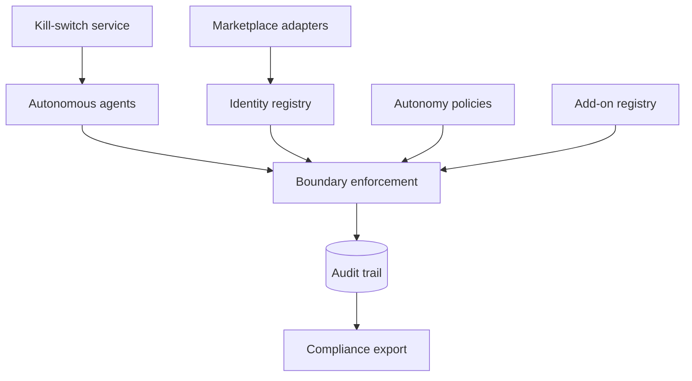

# Agentfence

**Source:** `ai-in-decentralized+ai/aiblockchainmattturck06282018final-180718222409/`
**Domain:** `ai-decentralized`
**One-liner:** An identity, audit, and autonomy-boundary control plane for autonomous AI agents in decentralised marketplaces — validating bot identity, enforcing action limits, maintaining tamper-evident audit trails, and providing enterprise kill-switches for multi-agent workflows.
**Wedge:** Enterprises deploying Fetch-style autonomous economic agents, SingularityNET sub-contracting agents, or internal bot swarms who need Botchain-like identity and audit plus a practical answer to Matt Turck's AI DAO problem: autonomous systems you cannot turn off.
**Positioning:** Agent governance for decentralised AI marketplaces. Turck's June 2018 deck contrasts centralized AI (black box, probabilistic) with crypto (decentralized, transparent) and maps Ocean/OpenMined/Algorithmia/Numerai/DeepBrain as decentralised data/model/compute marketplaces — then points to the next wave: AI agent networks (Fetch AEAs, SingularityNET, Botchain for identity/audit/autonomy boundaries) and AI DAOs that are hard to shut down. Agentfence is the control plane for boundaries and kill-switch — distinct from Fedbounty (federated model bounties).

## Market research synthesis

### Thesis from source

Matt Turck's "AI & Blockchain: An Introduction" (FirstMark, June 2018) frames AI and blockchain as defining technologies of the next decade alongside IoT, despite opposing paradigms: crypto decentralised/open/transparent/deterministic versus AI centralised/closed/black-box/probabilistic. Chris Dixon's platform-dependency critique motivates blockchain as foil to GAFA monopolies and surveillance.

Two big combined ideas emerge: decentralised AI marketplaces (data, models, compute tokenised — Ocean metadata protocols, OpenMined private ML, Algorithmia model crowdsourcing, Numerai staked competitions, DeepBrain compute) and AI networks plus decentralised autonomous organisations. Marketplaces use tokens to solve cold start and align data providers, scientists, and users (Fred Ehrsam quote on multi-sided network effects).

The agent-network section is the wedge: today many specialised "AI for X" bots; tomorrow combinations for ambitious projects in an open manner. Fetch proposes Autonomous Economic Agents (AEAs) transacting without human intervention, an open economic framework, scalable smart ledger — example orchestrating complex travel with rerouting. SingularityNET offers a decentralised marketplace where agents sub-contract specialised sub-agents with staking and reputation. Botchain (from the deck) targets secure identity for autonomous agents: bot identity and validation, audit and compliance, control boundaries of autonomy, shared marketplace for bot add-ons.

AI DAOs extend autonomy further — a computational system on decentralised infrastructure with feedback loops (example: decentralised autonomous Uber of autonomous vehicles). Turck's punchline: "Only one issue with AI DAOs… You wouldn't be able to turn them off… ever." Conclusion: fascinating, early, experimental, high complexity — but infrastructure is being built now and implications deserve proactive design.

Agentfence productises the missing enterprise layer: not the marketplace itself, but identity, audit, autonomy limits, and kill-switch governance so organisations can participate in agent networks without accepting irreversible autonomy.

### Buyer & economic model

- **Primary buyer:** CISO or VP Engineering owning enterprise multi-agent automation with board-level AI risk mandate.
- **Users:** agent platform engineers registering bots, security architects defining autonomy boundaries, compliance officers reviewing audit trails, marketplace operators requiring agent attestation, incident responders invoking kill-switch.
- **Budget owner / value metric:** security and platform budget; value metric is prevented autonomous actions outside policy, mean time to contain rogue agent, and audit pass rate for agent marketplace participation.
- **Competing status quo:** ad hoc API keys per bot, centralized logging without identity binding, manual circuit breakers, or avoiding decentralised marketplaces entirely due to DAO off-switch fear.

### Domain constraints

- **Regulatory / trust / safety:** accountability for automated decisions; GDPR/log retention if agents touch personal data; financial services rules when agents transact; irreversibility of on-chain agent commitments.
- **Data sensitivity:** audit trails may contain action metadata; agent credentials are secrets; kill-switch events are highly sensitive operationally.
- **Change-management realities:** agents may span Fetch, SingularityNET, and internal orchestrators — Agentfence must federate identity without owning each marketplace's stack.

## Business requirements

- BR-1: Every autonomous agent must register a cryptographically verifiable identity before joining an enterprise workflow or external marketplace.
- BR-2: Autonomy boundaries (spend limits, data domains, callable tools, sub-agent depth) must be enforced at runtime, not only in policy documents.
- BR-3: All material agent actions must append to a tamper-evident audit trail suitable for compliance review.
- BR-4: Enterprise kill-switch must halt an agent, its sub-contracted agents, and pending transactions within a defined SLA — addressing the AI DAO off-switch problem for governed deployments.
- BR-5: Marketplace add-ons (Botchain-style shared extensions) must be allowlisted with supply-chain attestation before agents may load them.
- BR-6: Sub-agent delegation (SingularityNET pattern) must inherit parent boundaries and aggregate audit context.
- BR-7: Staking/reputation signals from external marketplaces may inform trust scores but must not override enterprise boundary rules.
- BR-8: Human-in-the-loop escalation must trigger when agents approach boundary thresholds (budget, data volume, prohibited domains).
- BR-9: Incident playbooks must link audit trails to kill-switch activation and post-mortem export.
- BR-10: Probabilistic AI outputs that drive transactions must log model/version provenance in the audit record.
- BR-11: Cross-marketplace agent identity must map to a single enterprise canonical ID to avoid shadow agents.
- BR-12: Negative-path default must deny new autonomous actions when audit or identity services are unavailable (fail closed).

## User stories

Canonical user stories live in sibling [USER_STORIES.md](USER_STORIES.md).

## System design

### Overview

Agentfence sits between enterprise orchestration and decentralised agent marketplaces. Agents register identities and policies; a policy enforcement point wraps each action (tool call, payment, sub-agent spawn); audit service records decisions with hashes; kill-switch service propagates halt signals to registered runtimes and marketplace adapters. Add-on registry governs extensions. The system embraces Turck's marketplace vision while giving enterprises Botchain-style controls and a practical off-switch for governed (non-DAO) deployments.

### Actors & boundaries

- **Actors:** enterprise agent owner, platform engineer, CISO, compliance, marketplace operator, incident responder, external agent marketplaces (Fetch, SingularityNET, etc.), Agentfence operator.
- **Trust boundary:** Agentfence holds identity, policy, and audit metadata — not marketplace training data or model weights. Kill-switch commands cross into agent runtimes through signed control channels.
- **Human-in-the-loop points:** add-on approval; kill-switch authorization; boundary exception grants; incident post-mortem.

### Core capabilities

1. **Agent identity registry** — attestation, marketplace ID mapping, credential rotation.
2. **Autonomy boundary enforcement** — spend, scope, tool, depth limits at runtime.
3. **Audit trail service** — append-only, tamper-evident action logs with model provenance.
4. **Kill-switch and containment** — halt agent trees and pending txs.
5. **Add-on marketplace governance** — allowlist and attestation for bot extensions.
6. **Delegation graph** — parent/child boundary inheritance for sub-agents.
7. **Trust signal ingestion** — optional staking/reputation from partner marketplaces.
8. **Incident and export** — playbooks, compliance bundles.

### Conceptual data

- **Primary entities:** AgentIdentity, AutonomyPolicy, BoundaryRule, AuditEvent, KillSwitchOrder, AddOnPackage, DelegationEdge, TrustSignal, Incident, MarketplaceAdapter.
- **Critical events:** agent registered, action allowed/denied, boundary breached, kill-switch invoked, add-on approved, sub-agent spawned.
- **Retention / audit needs:** audit logs retained for regulatory windows; kill-switch records immutable; credentials rotated with history.

### Integrations (conceptual)

- **Systems of record:** enterprise IAM, agent runtimes (Fetch AEA, SingularityNET agents, internal LangChain-style orchestrators), marketplace APIs, SIEM.
- **Upstream signals:** agent heartbeats, transaction intents, staking/reputation feeds, anomaly detections.
- **Downstream actions:** allow/deny gates, kill-switch webhooks, audit export, marketplace suspension requests.

### High-level architecture

### Success metrics

- **Leading:** percentage of agent actions passing through PEP; time to execute kill-switch; add-ons blocked at registry; boundary near-miss escalations.
- **Lagging:** incidents contained without financial loss; audit findings cleared; enterprise marketplace participation rate; mean time to recover after kill-switch; zero unregistered shadow agents in production scans.

## OpenAPI skeleton

Canonical HTTP surface lives in sibling [openapi.yaml](openapi.yaml). Summary:

- **Base path:** `/v1/...`
- **Auth:** `X-API-Key` for agent runtime PEP callbacks; Bearer JWT for security and compliance consoles.
- **Resource groups:** Agents, Policies, Audits, KillSwitch, AddOns, Reporting.
