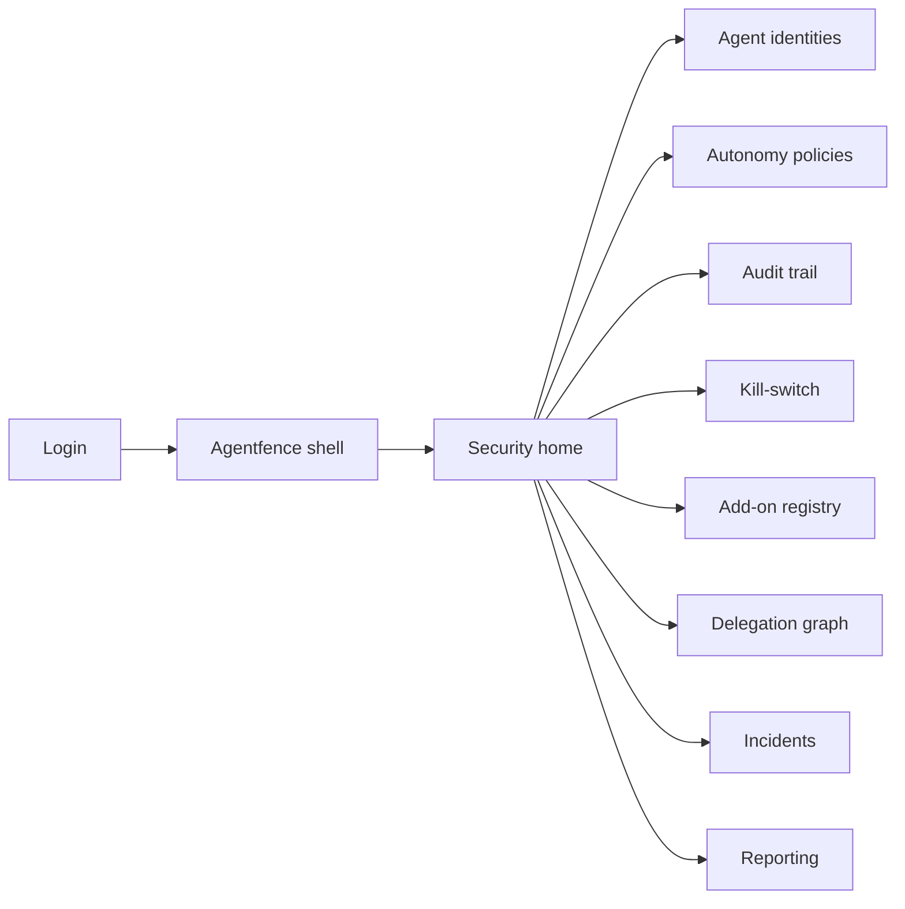
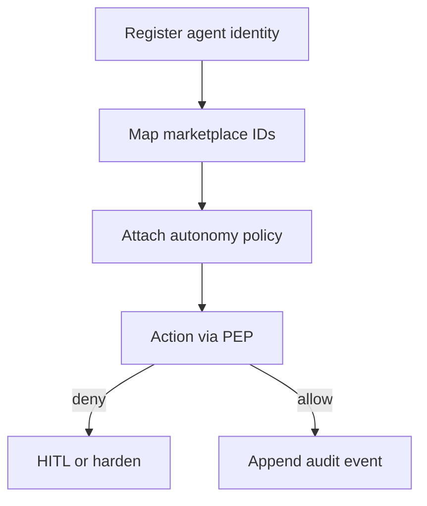

# Agentfence — Web app

**Product:** [PRODUCT.md](./PRODUCT.md)
**Primary surface:** Security / platform control plane for autonomous agents (identity, boundaries, kill-switch)
**Secondary surfaces:** Marketplace operator attestation verifier (read-only); incident post-mortem export
**Design thesis:** Agentfence is an autonomy fence and off-switch for multi-agent workflows — the UI metaphor is a blast door and sealed identity ledger, not a Fetch/SingularityNET marketplace storefront. Visual language is charcoal with hazard-amber near-limit warnings and emergency-red for kill-switch armed states; allowed actions feel greenlit through a narrow gate. The brand wordmark sits as a quiet steel stamp on every kill and audit screen so CISOs know whose answer to Turck’s “you cannot turn them off” problem they are operating.

## UX research synthesis

### Category peers (best-in-class)

- **Okta / enterprise IAM agent & workload identity:** Cryptographic workload identity and rotation. Steal: register verifiable agent identity before any workflow join (BR-1, BR-11); reject long-lived shared API keys as the primary model.
- **Palo Alto / cloud runtime security (tool allowlists):** Runtime enforcement of callable tools and domains. Steal: boundaries enforced at invocation, not PDF policy (BR-2); reject advisory-only dashboards.
- **Botchain-inspired agent identity concepts (per Turck deck):** Identity, audit, autonomy boundaries for bots. Steal: audit + boundary + add-on allowlist as one plane (BR-3, BR-5); reject marketplace shopping as the home.
- **PagerDuty / incident containment consoles:** One-click containment with SLA. Steal: kill-switch halts agent trees and pending txs within SLA (BR-4); reject “ticket only” without runtime halt.

### Patterns to adopt / reject

- **Adopt:** Fail-closed when identity/audit down (BR-12); sub-agent inheritance of spend/depth (BR-6); HITL near thresholds (BR-8); model/version provenance on transactional actions (BR-10); external staking signals advisory only (BR-7); add-on supply-chain attestation.
- **Reject:** Irreversible AI DAO as product goal; Fedbounty holdout scoring as home; purple agent marketplace mall; silent override of enterprise boundaries by reputation scores.

### Trust, density, and workflow constraints from PRODUCT.md

Identity before join (BR-1). Runtime boundaries (BR-2). Tamper-evident audit (BR-3). Kill-switch with SLA including sub-agents (BR-4). Add-on allowlist (BR-5). Delegation inheritance (BR-6). Reputation cannot override policy (BR-7). HITL near limits (BR-8). Incident playbooks link audit↔kill (BR-9). Model provenance in audit (BR-10). Canonical enterprise ID across marketplaces (BR-11). Fail closed (BR-12).

## Information architecture

### Nav model

### Roles → default home

| Role | Default home | Why |
|------|--------------|-----|
| CISO / security architect | Security home / Kill-switch | Off-switch readiness (BR-4) |
| Platform engineer | Agent identities | Register AEAs with scoped creds |
| Compliance officer | Audit trail / Reporting | Tamper-evident exports (BR-3) |
| Incident responder | Kill-switch / Incidents | Contain anomalies (BR-9) |
| Marketplace operator (partner) | Attestation verifier | Check enterprise-attested bots |
| Platform administrator | Fail-closed status / Add-ons | Deny when services down (BR-12) |

### Cross-links to OpenAPI resources

| Nav area | OpenAPI tags / resources |
|----------|---------------------------|
| Agent identities | Agents |
| Autonomy policies | Policies |
| Audit trail | Audits |
| Kill-switch | KillSwitch |
| Add-on registry | AddOns |
| Reporting | Reporting |

## Screen inventory

### Security home

- **Purpose:** Answer “which agents are near limits — and can we halt them now?” in one composition.
- **Entry:** CISO/security post-login.
- **Layout regions:** Brand; agents by risk band; near-limit HITL queue; kill-switch readiness SLA; fail-closed service health; shadow-agent scan count.
- **Primary actions:** Open agent; arm kill; review denied actions.
- **Empty / loading / error:** Empty = register first agent identity; error = fail-closed banner if PEP unreachable.
- **BR / story ties:** BR-4, BR-8, BR-12; CISO stories.

### Agent identity registry

- **Purpose:** Cryptographic identity, marketplace ID mapping, credential rotation, canonical enterprise ID.
- **Entry:** Nav → Agents; engineer default.
- **Layout regions:** Agent list; attestation status; marketplace mappings (Fetch/SingularityNET/internal); rotation history; shadow-agent conflicts.
- **Primary actions:** Register; rotate secrets; map marketplace ids; suspend unregistered.
- **Empty / loading / error:** Unmapped marketplace id = cannot join workflow (BR-1, BR-11).
- **BR / story ties:** BR-1, BR-11; platform engineer stories.

### Autonomy policy editor

- **Purpose:** Define spend, data domains, tools, sub-agent depth — enforced at runtime.
- **Entry:** Agent detail; nav → Policies.
- **Layout regions:** Boundary rules; inheritance preview for children; HITL threshold sliders; reputation signal note (advisory only).
- **Primary actions:** Save policy; simulate invocation; publish.
- **Empty / loading / error:** Missing policy = deny all autonomous actions.
- **BR / story ties:** BR-2, BR-6, BR-7.

### Runtime enforcement / denied actions feed

- **Purpose:** Show allow/deny at PEP with near-miss escalations.
- **Entry:** Home near-limit rail; live feed.
- **Layout regions:** Stream of decisions; reason codes; escalate to human; model/version for transactional outputs.
- **Primary actions:** Approve one-time exception (logged); harden rule; open audit.
- **Empty / loading / error:** Service down = fail-closed (BR-12).
- **BR / story ties:** BR-2, BR-8, BR-10.

### Audit trail explorer

- **Purpose:** Tamper-evident append-only log for compliance.
- **Entry:** Compliance default; agent drill-down.
- **Layout regions:** Event table with hashes; filter by agent/tree; provenance fields; integrity verify.
- **Primary actions:** Verify chain; export bundle; link to incident.
- **Empty / loading / error:** Integrity break = coral blocking state.
- **BR / story ties:** BR-3, BR-10.

### Kill-switch console

- **Purpose:** Halt agent, sub-agents, and pending transactions within SLA.
- **Entry:** CISO/incident default; anomaly alert.
- **Layout regions:** Target picker (agent family); blast radius preview (delegation graph); SLA timer; authorisation dual-control; confirmation.
- **Primary actions:** Arm; execute; confirm halt acks from adapters; open post-mortem.
- **Empty / loading / error:** Partial halt = keep retrying + escalate (BR-4).
- **BR / story ties:** BR-4, BR-9; incident responder stories.

### Add-on registry

- **Purpose:** Allowlist Botchain-style extensions with supply-chain attestation.
- **Entry:** Nav → Add-ons.
- **Layout regions:** Package list; attestation status; approval workflow; blocked loads.
- **Primary actions:** Submit; approve; revoke; force unload.
- **Empty / loading / error:** Unallowlisted add-on = deny load (BR-5).
- **BR / story ties:** BR-5; compliance stories.

### Delegation graph

- **Purpose:** Visualise parent/child agents with inherited boundaries.
- **Entry:** From kill blast radius; nav.
- **Layout regions:** Graph; aggregated spend; depth; audit context inheritance.
- **Primary actions:** Drill child; tighten parent policy; select tree for kill.
- **Empty / loading / error:** Orphan child without parent policy = deny spawn (BR-6).
- **BR / story ties:** BR-6.

### Incidents and reporting

- **Purpose:** Playbooks linking audit to kill; compliance exports.
- **Entry:** Post-kill; compliance export.
- **Layout regions:** Incident timeline; attached audit slice; post-mortem; period reports.
- **Primary actions:** Close incident; export; notify marketplace suspension.
- **Empty / loading / error:** Empty = healthy.
- **BR / story ties:** BR-9; Reporting tag.

## Key flows

1. **Governed agent join** — register identity → map marketplace ids → attach policy → PEP allows first action; failure: unregistered or fail-closed deny (BR-1, BR-2, BR-12).

2. **Sub-agent delegation** — parent spawns child → inherit spend/depth → aggregate audit (BR-6).

3. **Near-limit HITL** — approach budget/data threshold → escalate → allow once or block (BR-8).

4. **Kill-switch containment** — anomaly → arm → halt tree + pending txs → ack within SLA → post-mortem (BR-4, BR-9).

5. **Add-on supply chain** — package submitted → attest → allowlist → load; else deny (BR-5).

## Design system

### Tokens (CSS variables)

- `--color-ink: #E8EAEF` — text
- `--color-charcoal-950: #0A0C10` — ground
- `--color-charcoal-900: #14181F` — panels
- `--color-gate: #3D9B78` — allowed action
- `--color-hazard: #E0A020` — near-limit HITL
- `--color-emergency: #E23B3B` — kill-switch armed / integrity break
- `--color-steel: #8B95A5` — secondary
- `--color-brand: #A7B0BE` — Agentfence wordmark (steel)
- `--font-display: "Chakra Petch", sans-serif` — control titles
- `--font-body: "IBM Plex Sans", sans-serif`
- `--font-mono: "IBM Plex Mono", monospace` — agent ids, hashes, tx refs
- `--space-1`…`--space-8`: 4px scale
- `--radius-sm: 2px`; `--radius-md: 6px` — sharp blast-door geometry
- `--motion-deny: 160ms ease-out` — deny flash
- `--motion-kill: 280ms ease-in-out` — kill veil
- `--motion-ack: 200ms ease-out` — halt acknowledgement
- Atmosphere: subtle blast-door rivet texture; no neon purple agent avatars; no marketplace product grid as home.

### Typography & brand

- Chakra Petch for security chrome and kill titles; Plex for density; mono for identities and hashes.
- Brand on kill-switch and audit exports.
- Login: brand hero; headline (“Boundaries — and an off-switch”); one CTA.

### Do / don’t

- **Do:** Fail closed; show blast radius before kill; inherit limits to children; keep reputation advisory.
- **Don’t:** Marketplace storefront home; irreversible DAO celebration; purple glow; override enterprise policy with staking scores.

### Accessibility & domain trust cues

- AA+ contrast; kill-switch requires confirm + dual control where configured; never colour-only.
- Live regions for kill execution and fail-closed transitions.
- Focus order: identity → policy → audit → kill → incident export.

## Component patterns

- **AgentIdentityCard** — attestation + marketplace mappings + canonical id.
- **BoundaryPolicyMatrix** — spend / domain / tool / depth.
- **PepDecisionFeed** — allow/deny stream with reason codes.
- **KillBlastRadius** — tree preview before halt.
- **TamperEvidentAuditRow** — hash-chained event with model provenance.
- **AddOnAttestationBadge** — supply-chain allowlist state.
- **DelegationInheritBanner** — child policy inheritance cue.
- **FailClosedBanner** — identity/audit unavailable deny-all.

## Out of scope for v1 web

- Building the decentralised marketplace itself (Ocean/Fetch storefronts); Fedbounty federated training exchange; irreversible AI DAO products; consumer chat UIs; native mobile SOS beyond responsive kill confirm.
